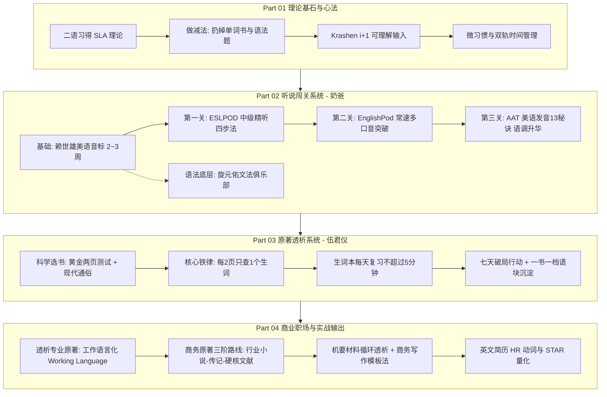
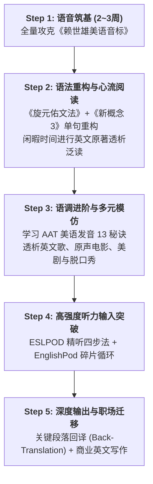

# 🛠️ 《把你的英语用起来！》全书方法论精读与实战指南

> **书名**：《把你的英语用起来！原地复活你放下多年的英语》  
> **作者**：伍君仪（透析英语创始人）、刘晓光（恶魔的奶爸）  
> **出版**：外文出版社 (2013)  
> **本地电子书文件**：[`01-把你的英语用起来.pdf`](../ebooks/01-把你的英语用起来.pdf)  
> **定位**：基于**二语习得理论（SLA）**的自学英语破局经典，贯穿“播讲类听说输入 + 原著透析阅读 + 商务工作语言化”。

---

## 🧭 全书方法论全景导航 (Methodology Map)

---

# Part 01 怎样学英语才是最有效的（理论与心法）

### 1. 核心理论：克拉申（Stephen Krashen）二语习得假说（SLA）
* **习得（Acquisition）vs 学得（Learning）**：
  * *学得* 只能产生心理“监控器”，开口前在大脑中翻译语法公式，导致反应迟钝；
  * *习得* 依靠海量无意识的沉浸式输入，在大脑中建立起直接的语言直觉回路。
* **$i+1$ 可理解性输入假说（Comprehensible Input）**：
  * 语言提升的唯一途径是吸收难度略高于当前水平（$i+1$）的素材；
  * $i+0$（太简单）无法进步，$i+3$（超纲太多，如初学者硬啃无字幕美剧或学术文献）会退化为无法解析的噪音。
* **情感过滤假说（Affective Filter Hypothesis）**：
  * 焦虑、恐惧、枯燥会导致大脑情感屏障升高，阻碍语言输入；
  * 轻松、有趣、即时正反馈能让过滤网降至最低，吸收效率提升数十倍。

### 2. 坚定做“减法”
1. **扔掉单词书（词汇表）**：脱离语境死记中文释义是效率最低的假努力；
2. **扔掉语法题海**：母语者靠语感网络讲话，不靠做单选题；
3. **扔掉苦行僧式的句子成分精读**：不过度做主谓宾切分，保护整体语流心流。

### 3. 微习惯与时间管理双轨制
* **黄金时间（30~60分钟，早晨或固定整块）**：用于精听、文本研读与出声影子跟读；
* **碎片时间（1~2小时，通勤、散步、家务）**：用于**单曲循环复听已学透的音频磨耳朵**。

---

# Part 02 透析法大战播讲类材料（听说突破系统）

### 1. 为什么必须选“播讲类材料（Podcasts with explanations）”？
* **对比美剧/电影**：画面干扰大、语速过快、容易依赖中文字幕；
* **对比普通新闻（VOA/BBC）**：生硬严肃，缺乏日常生活生命力；
* **播讲类材料的核心优势**：母语外教用地道慢速/常速进行 **English-in-English 口语化讲解**，自带保姆级可理解性阶梯。

### 2. 听说进阶四大阶梯

| 阶段 | 核心材料 / 课程 | 耗时周期 | 核心目标与操作方法 |
| :--- | :--- | :---: | :--- |
| **发音准备** | **《赖世雄美语音标》** | 2~3 周 | 对着镜子看口型，大声夸张朗读，彻底纠正中国学生元音不饱满、`/v/`与`/w/`、`/θ/`与`/s/`、`/l/`与`/r/`易混淆等发音缺陷。 |
| **第一关（中级）** | **ESLPOD (English as a Second Language Podcast)** *(推荐6本经典教材套系)* | 3~4 个月 | **精听四步法**： ① **盲听（1~2遍）** 抓大意与盲点； ② **对照文本听讲解** 搞懂生词与文化； ③ **扫清词汇障碍** 大声朗读文本； ④ **脱稿影子跟读（Shadowing）** 模仿语调连读直到同步。 |
| **第二关（中高级）** | **EnglishPod (全365期)** | 2~3 个月 | **突破 100% 真实母语常速（Native Speed）与多元口音**。 研读 Dialogue Script 剧本，提取高频俚语与生活化语块，将 Dialog-Only 纯对话音频在碎片时间单曲循环。 |
| **第三关（高级）** | **AAT《标准美语发音的13秘诀》** *(American Accent Training)* | 1 个月 | **攻克地道美式韵律与音乐感**： ① **梯阶语调（Staircase Intonation）** 重读爬升与滑动； ② **连读与同化（Liaisons）**； ③ **美音 4 种 T 音变**（Flap T 闪音, Glottal T 喉塞音, Held T 停顿, Silent T 静音）。 |

### 3. 语法底层认知：旋元佑《英文魔法师语法俱乐部 / 旋元佑文法》
* **核心定位**：底层操作系统与解惑地图，**绝不刷题、不背死规则**；
* **核心心法**：掌握“五大基本句型”与统一优美的**“从句简化理论（Clause Reduction）”**，长难句迎刃而解。

---

# Part 03 透析法大战英文原著（阅读与词汇系统）

### 1. 科学选书第一性原理
* **黄金两页测试法（3分钟定生死）**：翻开第 3~5 页连续读两页：
  * 生词 $\le 2$ 个且理解顺畅 $	o$ **选它！（完美 $i+1$ 心流）**
  * 生词 $> 5$ 个且读不懂 $	o$ **果断放弃（属于 $i+3$，避免耗尽意志力）**。
* **题材原则**：优先选 2000 年之后的**当代通俗小说（Thriller/Fiction）与现代非虚构（Pop Non-fiction）**；初学者坚决不碰 19 世纪古典文学。

### 2. 透析法核心心法：**每 2 页只查 1 个生词（The 50% Rule）**
* **严格限额**：纸质书每开一页（左右两面）/ 电子书每两屏，**最多只查 1 个核心生词**；
* **保护心流**：其余生词靠上下文猜测或直接略过，保持高速翻页带来的正反馈；
* **生词复习策略**：存入电子词典生词本，**每天只需浏览 3~5 分钟，绝对不强制死背**，依靠后续章节与其他书籍中的**“自然高频重现”**完成终身记忆。

### 3. 执行与打卡闭环
* **七天置之死地行动**：选一本 100~200 页薄原著，7 天内读完，打破“一辈子没读过一本原著”的心魔；
* **一年 10 本原著长跑**：累计 80~100 万字的高质量输入，词汇量与语感脱胎换骨；
* **一书一档读后档案**：记录元数据 + 提取 3~5 个高价值语块 + 个人生活场景微造句 + AI 对话交锋。

---

# Part 04 商业社会的常用英语（职场与工作语言化）

### 1. 英语工作语言化（Working Language）
* **专业降维**：读自己专业领域的英文原著与文献，比读小说更容易（已有丰富的中文专业背景图式支撑）；
* **商务英语真相**：纯商业教材（如 MBA《博迪投资学》）的词汇量远少于文学作品，语言标准规范，是纸老虎。

### 2. 提升商务英语三阶路线图
1. **Step 1 行业小说打底**：阿瑟·黑利（Arthur Hailey）的职场行业小说（《钱商》《大饭店》《航空港》）；
2. **Step 2 商业畅销与传记**：《谁动了我的奶酪》《金钱心理学》《鞋狗》《从0到1》《乔布斯传》；
3. **Step 3 硬核教材与智库**：哈佛商业评论（HBR）、专业白皮书、行业前沿研报。

### 3. 机要材料循环透析与商务写作模板法
* **循环透析（Cyclic Dialysis）**：面对涉外合同、高层汇报等不允许歧义的文件，通过 2~3 轮提高密度的循环精读彻底过滤生词；
* **模板置换法**：收集母语商务邮件与报告模板，只做骨架语块置换，确保 100% 安全地道。

---

# 📚 附录精粹与 100 本原著推荐库

* **附录 1（生活贴士）**：利用**微信异步语音条**进行口语对练（思考好再发、上滑取消、回听纠错）；桌面壁纸英语矩阵；英文菜谱实操。
* **附录 2.1（EP商业频道）**：EnglishPod 商业频道期数索引（商务谈判、危机处理、职场对话）。
* **附录 2.3（全球媒体）**：CNN, BBC, NPR, Bloomberg 全球主流英文流媒体直链。
* **附录 3（科学数据）**：`testyourvocab.com` 统计显示母语成人词汇量在 20,000~35,000；非母语者通过高质量沉浸输入，国内同样能实现词汇指数级增长。

---

### 📖 附录 2.2：经典、畅销英文原著 100 本难度全览表

> **说明**：按**首万词不重复词数（STTR）从少到多**排序。STTR 越小代表生词密度越低、越容易上手；蓝思值（Lexile）衡量句子结构复杂度。

| 序号 | 英文原著名称 (Title) | 中文译名 (Chinese Title) | 作者 (Author) | 总词数 (Words) | 首万词不重复词数 (STTR) | 蓝思值 (Lexile) |
| :---: | :--- | :--- | :--- | :---: | :---: | :---: |
| 1 | **Investments** | 《博迪投资学》 | Zvi Bodie（兹维·博迪） | 576,493 | **1160** | `NA` |
| 2 | **Who Moved My Cheese?** | 《谁动了我的奶酪？》 | Spencer Johnson（斯宾塞·约翰逊） | 10,886 | **1396** | `880L` |
| 3 | **The Chronicles of Narnia 2: The Lion, the Witch and the Wardrobe** | 《纳尼亚传奇2：狮王、女巫和魔衣柜》 | C.S. Lewis（C.S.路易斯） | 37,702 | **1419** | `940L` |
| 4 | **The Catcher in the Rye** | 《麦田里的守望者》 | J.D. Salinger（J.D.塞林格） | 74,230 | **1423** | `790L` |
| 5 | **The Chronicles of Narnia 1: The Magician's Nephew** | 《纳尼亚传奇1：魔法师的外甥》 | C.S. Lewis（C.S.路易斯） | 41,791 | **1490** | `790L` |
| 6 | **The Old Man and the Sea** | 《老人与海》 | Ernest Hemingway（欧内斯特·海明威） | 26,988 | **1554** | `940L` |
| 7 | **The Chronicles of Narnia 7: The Last Battle** | 《纳尼亚传奇7：最后一战》 | C.S. Lewis（C.S.路易斯） | 43,871 | **1573** | `890L` |
| 8 | **Investing Demystified: A Self-Teaching Guide** | 《揭秘投资：自学指南》 | Paul Lim（保罗·林） | 132,483 | **1584** | `NA` |
| 9 | **Making Millions for Dummies** | 《傻瓜书之成为百万富翁》 | Robert Doyen & Meg Schneider（罗伯特·都隐、梅格·施耐德） | 144,991 | **1607** | `NA` |
| 10 | **The Little Prince** | 《小王子》 | Antoine de Saint-Exupéry（安东尼·德·圣-埃克苏佩里） | 17,161 | **1613** | `710L` |
| 11 | **The Chronicles of Narnia 5: The Silver Chair** | 《纳尼亚传奇5：银椅》 | C.S. Lewis（C.S.路易斯） | 53,145 | **1629** | `840L` |
| 12 | **Ace the Interview** | 《面试制胜秘诀》 | Tony Beshara（托尼·贝沙拉） | 107,844 | **1658** | `NA` |
| 13 | **The Chronicles of Narnia 3: Prince Caspian** | 《纳尼亚传奇3：凯斯宾王子》 | C.S. Lewis（C.S.路易斯） | 48,743 | **1663** | `870L` |
| 14 | **Daughter of Deceit** | 《欺骗的女儿》 | Victoria Holt（维多利亚·霍尔特） | 124,575 | **1684** | `570L` |
| 15 | **Pride and Prejudice** | 《傲慢与偏见》 | Jane Austen（简·奥斯汀） | 118,307 | **1684** | `1100L` |
| 16 | **Everyone's Money Book** | 《所有人的金钱书》 | Jordan E. Goodman（约旦·E.古德曼） | 389,047 | **1695** | `NA` |
| 17 | **The Odyssey** | 《奥德赛》 | Homer（荷马） | 117,260 | **1702** | `1050L` |
| 18 | **The Lord of the Rings 2: The Two Towers** | 《魔戒2：双塔奇兵》 | J.R.R. Tolkien（J.R.R.托尔金） | 154,450 | **1715** | `810L` |
| 19 | **Oedipus the King** | 《俄狄浦斯王》 | Sophocles（索福克勒斯） | 17,236 | **1724** | `940L` |
| 20 | **Robinson Crusoe** | 《鲁滨逊漂流记》 | Daniel Defoe（丹尼尔·笛福） | 122,124 | **1730** | `1320L` |
| 21 | **Principles of Economics (3rd Edition)** | 《经济学原理》（第3版） | N. Gregory Mankiw（N.格里高利·曼昆） | 372,838 | **1756** | `NA` |
| 22 | **The Chronicles of Narnia 6: The Horse and His Boy** | 《纳尼亚传奇6：能言马与男孩》 | C.S. Lewis（C.S.路易斯） | 51,988 | **1778** | `970L` |
| 23 | **Rich Dad, Poor Dad** | 《富爸爸，穷爸爸》 | Robert Kiyosaki（罗伯特·清崎） | 57,380 | **1799** | `860L` |
| 24 | **Sophie's World** | 《苏菲的世界》 | Jostein Gaarder（乔斯坦·贾德） | 182,226 | **1807** | `NA` |
| 25 | **Charlotte's Web** | 《夏洛的网》 | E.B. White（E.B.怀特） | 32,593 | **1817** | `680L` |
| 26 | **La Dame aux Camélias** | 《茶花女》 | Alexandre Dumas, fils（小仲马） | 66,561 | **1846** | `NA` |
| 27 | **Human Resource Management (12th Edition)** | 《人力资源管理》（第12版） | Robert L. Mathis & John H. Jackson（罗伯特·L.马蒂斯、约翰·H.杰克逊） | 286,627 | **1855** | `NA` |
| 28 | **Harry Potter and the Philosopher's Stone** | 《哈利·波特与魔法石》 | J.K. Rowling（J.K.罗琳） | 78,760 | **1856** | `880L` |
| 29 | **The Count of Monte Cristo** | 《基督山伯爵》 | Alexandre Dumas, père（大仲马） | 464,536 | **1876** | `NA` |
| 30 | **The Chronicles of Narnia 4: The Voyage of the Dawn Treader** | 《纳尼亚传奇4：黎明破浪号》 | C.S. Lewis（C.S.路易斯） | 45,522 | **1892** | `970L` |
| 31 | **Writing, Speaking, Listening: The Essentials of Business Communication** | 《写作、口语、听力：商务交流要领》 | Helen Wilkie（海伦·威尔基） | 15,634 | **1901** | `NA` |
| 32 | **The Moonstone** | 《月亮宝石》 | Wilkie Collins（威尔基·柯林斯） | 197,946 | **1915** | `1040L` |
| 33 | **Hearts in Atlantis** | 《亚特兰蒂斯之心》 | Stephen King（史蒂芬·金） | 187,275 | **1943** | `NA` |
| 34 | **David Copperfield** | 《大卫·科波菲尔》 | Charles Dickens（查尔斯·狄更斯） | 359,101 | **1954** | `1070L` |
| 35 | **Introduction to Business (Student Edition)** | 《商业简介》（学生版） | Glencoe McGraw-Hill（麦格劳-希尔） | 329,645 | **1955** | `NA` |
| 36 | **The Hobbit** | 《魔戒前传：霍比特人》 | J.R.R. Tolkien（J.R.R.托尔金） | 95,692 | **1958** | `1000L` |
| 37 | **Business Etiquette For Dummies** | 《商务礼仪傻瓜书》 | Sue Fox（苏·福克斯） | 122,607 | **1959** | `NA` |
| 38 | **The Toyota Way** | 《丰田模式》 | Jeffrey Liker（杰弗里·莱克） | 130,362 | **1984** | `NA` |
| 39 | **Crime and Punishment** | 《罪与罚》 | Fyodor Dostoevsky（陀思妥耶夫斯基） | 203,189 | **2015** | `990L` |
| 40 | **War and Peace** | 《战争与和平》 | Leo Tolstoy（列夫·托尔斯泰） | 564,614 | **2019** | `NA` |
| 41 | **Twilight 2: New Moon** | 《暮光之城2：新月》 | Stephenie Meyer（斯蒂芬妮·梅尔） | 135,351 | **2021** | `690L` |
| 42 | **Norwegian Wood** | 《挪威的森林》 | Haruki Murakami（村上春树） | 121,121 | **2024** | `790L` |
| 43 | **The Shawshank Redemption** | 《肖申克的救赎》 | Stephen King（史蒂芬·金） | 40,519 | **2036** | `NA` |
| 44 | **Harry Potter and the Goblet of Fire** | 《哈利·波特与火焰杯》 | J.K. Rowling（J.K.罗琳） | 196,151 | **2067** | `880L` |
| 45 | **Alice's Adventures in Wonderland** | 《爱丽丝漫游奇境记》 | Lewis Carroll（刘易斯·卡罗尔） | 23,953 | **2067** | `980L` |
| 46 | **Harry Potter and the Chamber of Secrets** | 《哈利·波特与密室》 | J.K. Rowling（J.K.罗琳） | 86,870 | **2079** | `940L` |
| 47 | **Twenty Thousand Leagues Under the Sea** | 《海底两万里》 | Jules Verne（儒勒·凡尔纳） | 100,160 | **2111** | `1030L` |
| 48 | **Harry Potter and the Half-Blood Prince** | 《哈利·波特与混血王子》 | J.K. Rowling（J.K.罗琳） | 173,411 | **2113** | `1030L` |
| 49 | **Twilight 3: Eclipse** | 《暮光之城3：月食》 | Stephenie Meyer（斯蒂芬妮·梅尔） | 157,349 | **2115** | `670L` |
| 50 | **Twilight 1: Twilight** | 《暮光之城1：暮色》 | Stephenie Meyer（斯蒂芬妮·梅尔） | 119,531 | **2120** | `720L` |
| 51 | **Winning** | 《赢》 | Jack Welch（杰克·韦尔奇） | 96,048 | **2142** | `NA` |
| 52 | **The Conquest of Happiness** | 《幸福之路》 | Bertrand Russell（伯特兰·罗素） | 55,351 | **2161** | `NA` |
| 53 | **Lady Chatterley's Lover** | 《查泰莱夫人的情人》 | D.H. Lawrence（D.H.劳伦斯） | 117,211 | **2164** | `NA` |
| 54 | **The Great Gatsby** | 《了不起的盖茨比》 | F. Scott Fitzgerald（F.斯科特·菲茨杰拉德） | 49,508 | **2167** | `1070L` |
| 55 | **Harry Potter and the Prisoner of Azkaban** | 《哈利·波特与阿兹卡班的囚徒》 | J.K. Rowling（J.K.罗琳） | 106,734 | **2172** | `880L` |
| 56 | **Howards End** | 《霍华德庄园》 | E.M. Forster（E.M.福斯特） | 109,860 | **2179** | `820L` |
| 57 | **Harry Potter and the Order of the Phoenix** | 《哈利·波特与凤凰社》 | J.K. Rowling（J.K.罗琳） | 262,579 | **2179** | `950L` |
| 58 | **The World Is Flat** | 《世界是平的》 | Thomas L. Friedman（托马斯·弗里德曼） | 174,625 | **2195** | `NA` |
| 59 | **Twilight 4: Breaking Dawn** | 《暮光之城4：破晓》 | Stephenie Meyer（斯蒂芬妮·梅尔） | 178,140 | **2202** | `690L` |
| 60 | **A Short History of Nearly Everything** | 《万物简史》 | Bill Bryson（比尔·布莱森） | 171,482 | **2204** | `1190L` |
| 61 | **The Godfather** | 《教父》 | Mario Puzo（马里奥·普佐） | 172,190 | **2213** | `NA` |
| 62 | **Steve Jobs** | 《史蒂夫·乔布斯传》 | Walter Isaacson（沃尔特·艾萨克森） | 238,341 | **2225** | `1080L` |
| 63 | **Death on the Nile** | 《尼罗河上的惨案》 | Agatha Christie（阿加莎·克里斯蒂） | 79,452 | **2228** | `660L` |
| 64 | **The Return of Sherlock Holmes** | 《福尔摩斯归来记》 | Arthur Conan Doyle（阿瑟·柯南·道尔） | 112,901 | **2228** | `1130L` |
| 65 | **The Bridges of Madison County** | 《廊桥遗梦》 | Robert James Waller（罗伯特·詹姆斯·沃勒） | 36,675 | **2232** | `NA` |
| 66 | **Gone with the Wind** | 《乱世佳人 / 飘》 | Margaret Mitchell（玛格丽特·米切尔） | 423,697 | **2240** | `1100L` |
| 67 | **Foundation** | 《基地》 | Isaac Asimov（艾萨克·阿西莫夫） | 70,025 | **2244** | `830L` |
| 68 | **The Three Musketeers** | 《三个火枪手》 | Alexandre Dumas, père（大仲马） | 229,523 | **2246** | `960L` |
| 69 | **The Unbearable Lightness of Being** | 《不能承受的生命之轻 / 布拉格之恋》 | Milan Kundera（米兰·昆德拉） | 85,340 | **2268** | `NA` |
| 70 | **The Red and the Black** | 《红与黑》 | Stendhal（司汤达） | 152,930 | **2274** | `NA` |
| 71 | **Sister Carrie** | 《嘉莉妹妹》 | Theodore Dreiser（西奥多·德莱塞） | 157,924 | **2277** | `980L` |
| 72 | **The Decameron** | 《十日谈》 | Giovanni Boccaccio（乔万尼·薄伽丘） | 307,538 | **2294** | `1500L` |
| 73 | **The Adventures of Tom Sawyer** | 《汤姆·索亚历险记》 | Mark Twain（马克·吐温） | 71,656 | **2295** | `950L` |
| 74 | **Sons and Lovers** | 《儿子与情人》 | D.H. Lawrence（D.H.劳伦斯） | 161,056 | **2295** | `NA` |
| 75 | **The Final Diagnosis** | 《最后诊断》 | Arthur Hailey（阿瑟·黑利） | 116,519 | **2297** | `NA` |
| 76 | **A Tale of Two Cities** | 《双城记》 | Charles Dickens（查尔斯·狄更斯） | 136,759 | **2316** | `NA` |
| 77 | **The Hunt for Red October** | 《猎杀红色十月》 | Tom Clancy（汤姆·克兰西） | 163,434 | **2344** | `870L` |
| 78 | **The Game** | 《把妹达人》 | Neil Strauss（尼尔·施特劳斯） | 149,451 | **2350** | `NA` |
| 79 | **Vanity Fair** | 《名利场》 | William Makepeace Thackeray（威廉·萨克雷） | 309,652 | **2354** | `1270L` |
| 80 | **One Hundred Years of Solitude** | 《百年孤独》 | Gabriel García Márquez（加夫列尔·加西亚·马尔克斯） | 143,272 | **2371** | `1410L` |
| 81 | **Harry Potter and the Deathly Hallows** | 《哈利·波特与死亡圣器》 | J.K. Rowling（J.K.罗琳） | 200,885 | **2376** | `980L` |
| 82 | **Hotel** | 《大饭店》 | Arthur Hailey（阿瑟·黑利） | 138,291 | **2417** | `NA` |
| 83 | **The Moneychangers** | 《钱商》 | Arthur Hailey（阿瑟·黑利） | 156,651 | **2457** | `NA` |
| 84 | **Freakonomics** | 《魔鬼经济学》 | Steven Levitt & Stephen Dubner（史蒂芬·列维特、史蒂芬·都伯纳） | 67,974 | **2465** | `NA` |
| 85 | **Wheels** | 《汽车城》 | Arthur Hailey（阿瑟·黑利） | 138,065 | **2486** | `NA` |
| 86 | **The Career Survival Guide: Making Your Next Career Move** | 《职场生存指南》 | Brian Connell（布莱恩·康奈尔） | 72,181 | **2494** | `NA` |
| 87 | **Jane Eyre** | 《简·爱》 | Charlotte Brontë（夏洛蒂·勃朗特） | 186,804 | **2522** | `890L` |
| 88 | **The Hunchback of Notre-Dame** | 《巴黎圣母院》 | Victor Hugo（维克多·雨果） | 185,305 | **2526** | `1340L` |
| 89 | **Airport** | 《航空港》 | Arthur Hailey（阿瑟·黑利） | 160,983 | **2536** | `NA` |
| 90 | **Tess of the d'Urbervilles** | 《德伯家的苔丝》 | Thomas Hardy（托马斯·哈代） | 150,395 | **2537** | `1160L` |
| 91 | **The Thorn Birds** | 《荆棘鸟》 | Colleen McCullough（考琳·麦卡洛） | 225,025 | **2571** | `990L` |
| 92 | **The Lord of the Rings 1: The Fellowship of the Ring** | 《魔戒1：魔戒再现》 | J.R.R. Tolkien（J.R.R.托尔金） | 178,794 | **2600** | `860L` |
| 93 | **The Lord of the Rings 3: The Return of the King** | 《魔戒3：国王归来》 | J.R.R. Tolkien（J.R.R.托尔金） | 108,117 | **2626** | `920L` |
| 94 | **Father Goriot** | 《高老头》 | Honoré de Balzac（奥诺雷·德·巴尔扎克） | 103,656 | **2663** | `NA` |
| 95 | **Angels & Demons** | 《天使与魔鬼》 | Dan Brown（丹·布朗） | 153,853 | **2684** | `NA` |
| 96 | **The Lost Symbol** | 《失落的秘符》 | Dan Brown（丹·布朗） | 166,319 | **2690** | `NA` |
| 97 | **Deception Point** | 《骗局 / 瞒天过海》 | Dan Brown（丹·布朗） | 143,341 | **2711** | `NA` |
| 98 | **Digital Fortress** | 《数字城堡》 | Dan Brown（丹·布朗） | 101,572 | **2734** | `NA` |
| 99 | **The Da Vinci Code** | 《达·芬奇密码》 | Dan Brown（丹·布朗） | 139,844 | **2782** | `850L` |
| 100 | **Wuthering Heights** | 《呼啸山庄》 | Emily Brontë（艾米莉·勃朗特） | 117,071 | **2929** | `880L` |

---

# ✍️ 读后感与个人学习蓝图 (Reading Notes & Personal Action Plan)

### 一、 核心知识点与方法论复盘 (Key Takeaways)

* **核心方法**：
  * **$i+1$ 可理解性输入**：始终寻找略高于自己当前水位的语料，杜绝低效的死记硬背与超纲的无谓挫败；
  * **微习惯与习惯捆绑法**：将英语输入绑定到晨起、通勤等固定生活线索，降低启动阻力；
  * **双轨时间管理法**：早晨整块黄金时间（精听/跟读/重构） + 全天碎片时间（单曲循环泛听）；
  * **影子跟读 (Shadowing)**：脱稿以落后原声半秒的节奏同步模仿，攻克连读与语调；
  * **碎片化单曲循环法**：提取已学透音频片段在零散时间反复磨耳朵，强化大脑听觉神经回路。
* **核心教材与材料**：
  * **发音与语调**：《赖世雄美语音标》 $\to$ 《American Accent Training (AAT)》；
  * **语法与句型**：《旋元佑文法俱乐部》（抓底层从句简化逻辑） + 《新概念英语 3》（精雕关键句式）；
  * **听力输入**：ESLPOD（变速精听四步法） $\to$ EnglishPod（365期常速多口音突破）。
* **量化理论支撑**：
  * **首万词词汇丰富度 (STTR)**：衡量生词密度的黄金尺子（<1500 入门，1500~2000 中级，>2000 高级文学）；
  * **蓝思值 (Lexile Measure)**：衡量句子与语法复杂度的科学测算。
* **多维透析体系**：
  * 涵盖**原著书、英语新闻、专业网站、英文歌、原声电影与美剧**的全方位透析。
* **透析长期复利**：
  * 单词在语境中自然高频重现、依托故事情节彻底解决生词背景记忆、大量吸收地道语块（Collocations）。
* **两大避坑 Tips**：
  1. **读完原著必须写一书一档读后档案**（提取 3~5 个语块并做场景微造句，拒绝纯搬运生词）；
  2. **选书必须有量化标准**（当代通俗优先，坚决读未删节真原著，避开 19 世纪古旧名著与简写本）。

---

### 二、 我的个人学习实施路线图 (My 5-Step Action Roadmap)

1. **第一阶段：语音筑基（2~3周）**
   * 集中精力吃透《赖世雄美语音标》，对着镜子校正口型与发音位置，彻底扫除发音盲点。
2. **第二阶段：语法重构 + 经典句式 + 原著阅读**
   * 通读《旋元佑文法俱乐部》，建立从句简化底层思维；
   * 开启《新概念 3》，采用“单句重构法”雕刻语法与句式精度；
   * 闲暇时间保持英文原著（如《谁动了我的奶酪》）零查词心流通读与一书一档沉淀。
3. **第三阶段：高级语调与原声影视模仿**
   * 音标打牢后进入《American Accent Training (AAT)》，掌握美语阶梯语调与连读音变；
   * 结合英文歌、原声电影、美剧与脱口秀进行影子跟读与趣味模仿。
4. **第四阶段：立体化听力输入破局**
   * 以 ESLPOD 6 大教材套系为核心做精听四步法与影子跟读；
   * 进阶 EnglishPod 常速对话，利用全天碎片时间单曲循环磨耳朵。
5. **第五阶段：深度回译与商业写作输出**
   * 在输入体量充足后，开展经典商业段落的局部回译练习；
   * 结合模板置换法，将沉淀的语块直接迁移到真实英文写作与职场工作交流中。
