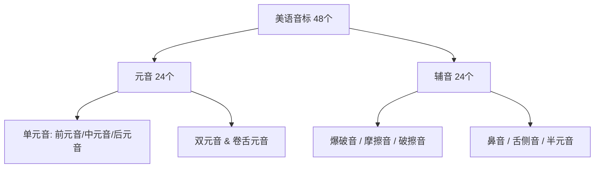

# 🗣️ 《赖世雄美语音标》精读与发音实战档案

> **教材**：《赖世雄美语音标》（美语从头学系列）  
> **作者**：赖世雄（常春藤英语创始人）  
> **定位**：美式英语（KK / IPA）口腔物理肌肉重构经典教程，零基础攻克 48 个纯正美音音标与拼读规律。  
> **本地教材**：[`books/toolbooks/ebooks/02-赖世雄美语音标.pdf`](../ebooks/02-赖世雄美语音标.pdf)

---

## 🧭 全书发音体系全景图 (Syllabus Map)

---

# 📖 第 01 阶段：音标总论与前元音对比实战 (P1 ~ P10)

## 一、 字母与音标总论 (P1 ~ P4)

1. **英语的本质**：英语是**表音文字（Phonetic Language）**，26 个英文字母本身代表不同的发音组合；
2. **字母 vs 音标**：
   * **字母（Letters）**：书写形式（如 A, B, C...）；
   * **音标（Phonetic Symbols）**：记录实际声音的符号工具（美式 KK 音标 / 国际音标 IPA）；
3. **发音器官核心调控**：
   * **声带振动（Voicing）**：浊辅音与元音振动，清辅音不振动；
   * **气流受阻部位（Place of Articulation）**：双唇、齿唇、齿间（咬舌）、齿龈、硬腭、软腭；
   * **阻碍方式（Manner of Articulation）**：爆破、摩擦、破擦、鼻腔共鸣。

---

## 二、 核心元音 1：长元音 `/iː/`（微笑音）(P5 ~ P6)

### 1. 口型与发音生理要领
* **唇形**：**极致微笑唇**——嘴角尽量向左右两侧拉开，呈扁平扁条状；
* **舌位**：舌尖轻抵下齿背，舌前部尽量向上颚隆起，但切勿触碰到上颚；
* **肌肉感觉**：**肌肉紧绷（Tense Vowel）**，发音饱满、清晰、悠长（/iː/）。

### 2. 常见核心拼读字母组合
| 字母组合 | 核心高频单词 (Word List) | 常用地道短语 / 场景微例句 |
| :--- | :--- | :--- |
| **ee** | **see, meet, tree, green, three, beef, seek, deep** | *Feel free to ask.* (请随时提问。) |
| **ea** | **tea, eat, meat, leave, lead, clean, speak, teach** | *Pleased to meet you.* (很高兴认识你。) |
| **e** | **he, she, we, me, be, even, these, evil** | *See what I mean?* (明白我意思了吧？) |
| **ie / ei** | **piece, believe, field, receive, ceiling** | *I believe in you.* (我相信你。) |

---

## 三、 核心元音 2：短元音 `/ɪ/`（放松音）(P7 ~ P10)

### 1. 口型与发音生理要领
* **唇形**：**自然微张、完全放松**——嘴角不用力，下巴自然微垂（开口度约半指宽）；
* **舌位**：舌前部微微抬起，但高度明显低于 `/iː/`；
* **肌肉感觉**：**肌肉完全放松（Lax Vowel）**，声音短促、有力，听感介于汉语“衣”与“也”之间。

### 2. 常见核心拼读字母组合
| 字母组合 | 核心高频单词 (Word List) | 常用地道短语 / 场景微例句 |
| :--- | :--- | :--- |
| **i** | **sit, fit, big, kid, fish, milk, kiss, trip, will, him** | *A big city.* (一座大城市。) |
| **y** | **city, happy, busy, party, family, windy** | *Keep it simple.* (保持简单。) |
| **e / ui / u**| **pretty, build, busy, minute** | *Just a minute.* (稍等片刻。) |

---

## 🔥 黄金生死对决：`/iː/` vs `/ɪ/` 最小对立体（Minimal Pairs）

> 💡 **赖老师纠偏心法**：很多中国学习者把 `/ɪ/` 读成短促的 `/iː/`，这是最常见的发音误区！必须靠**“肌肉紧张微笑 vs 下巴微垂放松”**来严格区分：

| `/iː/` (微笑长元音·肌肉紧) | `/ɪ/` (下巴微垂·肌肉松) | 语义差异与避坑例句 |
| :--- | :--- | :--- |
| **sheep** /ʃiːp/ (绵羊) | **ship** /ʃɪp/ (轮船) | *Look at that sheep on the ship.* |
| **seat** /siːt/ (座位) | **sit** /sɪt/ (坐下) | *Please take a seat and sit down.* |
| **feel** /fiːl/ (感觉) | **fill** /fɪl/ (填满) | *I feel good after I fill the tank.* |
| **leave** /liːv/ (离开) | **live** /lɪv/ (居住/生存) | *I must leave where I live.* |
| **heat** /hiːt/ (热度) | **hit** /hɪt/ (击打) | *The heat hit me suddenly.* |
| **feet** /fiːt/ (双脚) | **fit** /fɪt/ (合脚/适合) | *These shoes fit my feet.* |
| **reach** /riːtʃ/ (触及/到达) | **rich** /rɪtʃ/ (富有) | *He reached out to the rich man.* |
| **sleep** /sliːp/ (睡觉) | **slip** /slɪp/ (滑倒) | *Don't slip while you sleep.* |

---

## 🎯 课后自检与肌肉记忆 Checklist
- [ ] 面对镜子发出 `/iː/` 时，嘴角是否充分向两侧拉开呈现微笑状？
- [ ] 发出 `/ɪ/` 时，下巴是否自然垂落半指宽，口型与面部肌肉是否处于彻底放松状态？
- [ ] 连续快速朗读 8 组 Minimal Pairs（如 *sheep/ship, seat/sit, feel/fill*），是否能在听觉和口腔肌肉上感受到清晰的阶梯级切换？
