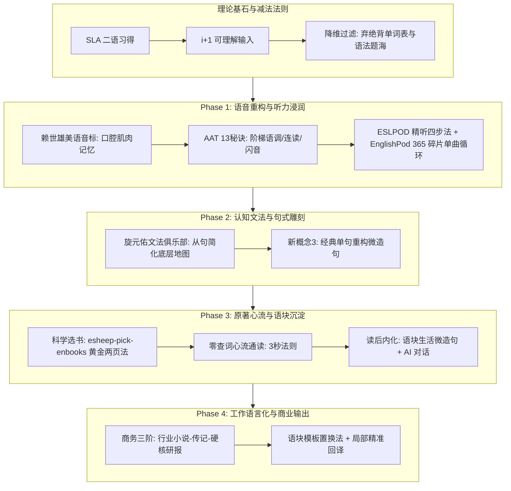

# 🧠 个人英语习得底层操作系统 (Personal English Acquisition Playbook)

> **"We acquire language in only one way: when we understand messages; when we receive 'comprehensible input' in a low-anxiety environment."**  
> —— Stephen Krashen (斯蒂芬·克拉申，二语习得理论大师)

---

## 🧭 架构导览 (Architecture Overview)

本项目不盲目照搬市面上任何单一教派，而是立足于**第二语言习得（SLA）第一性原理**，熔铸《把你的英语用起来！》、克拉申 $i+1$ 理论、旋元佑文法、赖世雄美语音标、AAT 语调与现代商务实战之精华，形成的**个人独家专属执行总纲**。



---

# Part 00 核心心法与减法法则 (First Principles)

### 1. 习得（Acquisition）高于学得（Learning）
* 传统应试英语把语言当成死知识，在大脑中建立起缓慢的“语法监控器”与“中英互译通道”；
* 真正流利的英语依靠海量**可理解输入（$i+1$）**，在大脑中直接建立直觉神经回路。

### 2. 坚定执行“三大减法”
1. ❌ **不背孤立单词书**：脱离语境的单词表属于死记硬背，遗忘率高达 90%；单词必须在原著与听力语境中自然偶遇 7~12 次完成附带习得。
2. ❌ **不做单选题与语法题海**：母语者靠语感网络讲话，不靠做语法题。
3. ❌ **不做全篇枯燥死译**：全篇回译耗尽心力，只针对经典单句进行精细重构与微造句。

---

# Part 01 语音重构与听力浸润 (Phonetics & Auditory Engine)

```
[赖世雄美语音标 (2~3周)] ➔ [AAT 美语发音13秘诀 (1个月)] ➔ [ESLPOD 精听 ➔ EnglishPod 常速突破]
```

### 1. 第一步：口腔物理肌肉重构（《赖世雄美语音标》）
* **周期**：2~3 周（集中突击）；
* **核心动作**：对着镜子看口型，大声夸张朗读；
* **重点纠偏**：元音饱满度、`/v/`与`/w/`咬唇音、`/θ/`与`/s/`咬舌音、`/l/`与`/r/`舌位切换。

### 2. 第二步：美语音乐感与语调升华（《American Accent Training (AAT)》）
* **核心心法**：英语是**重音计时语言（Stress-Timed）**，不是音节计时语言；
* **三大核心秘诀**：
  1. **阶梯语调（Staircase Intonation）**：句中重读词音高爬升与向下滑动；
  2. **美音 4 种 T 音变**：Flap T（闪音如 *water, butter*）、Glottal T（喉塞音）、Held T（闭气停顿）、Silent T（省音）；
  3. **连读、同化与弱读**：辅元连读、`/t, d, s, z/ + /j/` 同化、中央元音 Schwa `/ə/` 极度弱读。

### 🏁 音标模块收官通关标准 (Phonetics Exit Criteria)
> 💡 **何时才能离开音标进入 AAT 语调与精听？** 必须通过以下**三大维度量化验收**，避免走马观花或过度拖延：
1. **肌肉记忆与零思考反射**：
   * **6 大高危对立体本能区分**：`/iː/ vs /ɪ/` (紧绷微笑 vs 放松微垂)、`/e/ vs /æ/` (一指 vs 两指半大开口)、`/ʌ/ vs /ɑː/` (短促中元音 vs 大开后元音)、`/v/ vs /w/` (咬下唇 vs 突嘴不咬唇)、`/θ/ vs /s/` (轻咬舌尖 vs 闭齿摩擦)、尾音 Dark L `/l/` (舌后部软腭化，绝不读成“欧”)。
   * **48 音标盲测**：任意抽出 1 个音标，**0.5 秒内**本能做出正确口型并发出纯正声音。
2. **查词典反向拼读（见标能读）**：
   * 翻开词典任意陌生生词，仅凭音标标注即可 100% 准确拼读出音节与主次重音，无需听音频示范。
3. **听觉辨音精度**：
   * 听原生外教快速读 *ship/sheep, bad/bed, vest/west*，辨音准确率 $\ge 95\%$。
4. **🏆 15 分钟终极通关考核（The 15-Min Exit Exam）**：
   * [x] 48 音标闪卡盲测全对（3 min）
   * [x] 6 大对立体录音自检与原声一致（5 min）
   * [x] 10 个词典陌生生词音标盲读全部正确（5 min）
   * [x] 盲听辨音 $\ge 90\%$ 正确率（2 min）
   * *通过后即刻通关，进入 AAT 阶梯语调与原声精听！*

### 3. 第三步：播讲类教材立体化听力输入
* **ESLPOD（精听四步法）**：
  1. 盲听 1~2 遍抓大意；
  2. 对照文本听慢速与英文讲解，扫除生词与文化盲点；
  3. 大声朗读文本；
  4. 脱稿**影子跟读（Shadowing）**，以落后原声半秒的节奏同步模仿。
* **EnglishPod（全 365 期常速多口音突破）**：
  * 将 1~2 分钟的 Dialog-Only 纯对话音频导入手机，全天**碎片时间单曲循环磨耳朵**。

---

# Part 02 认知文法与经典句式雕刻 (Cognitive Grammar)

### 1. 底层操作系统：旋元佑《文法俱乐部》
* **定位**：语法解惑地图与认知底层，绝不刷题；
* **核心理论**：
  * **五大基本句型**：看清句子骨干主干；
  * **从句简化大一统理论（Clause Reduction）**：形容词从句 $\to$ 分词短语/同位语，副词从句 $\to$ 状语从句简化，长难句迎刃而解。

### 2. 句式精度雕刻：《新概念英语 3》单句重构法
* **操作 SOP**：
  1. 挑选一课中的 1~2 个核心经典复合句；
  2. 分析其从句连接与修辞语块；
  3. 结合自己的实际生活/工作场景，进行**单句微迁移造句**，不搞全篇机械翻译。

---

# Part 03 原著心流与语块沉淀 (Dialysis Reading)

### 1. 科学选书标准（执行 `engine/skills/esheep-pick-enbooks`）
* **三大绝对筛除项**：坚决不读简写本/改写本（拒绝书虫等干瘪语言）；初中级坚决不碰 19 世纪以前古典名著；坚决不为面子硬啃无趣书籍。
* **量化标尺**：首万词丰富度（STTR < 2000）、蓝思值（700L ~ 1000L）。
* **3 分钟黄金两页实测法**：翻开第 3~5 页读两页，生词 $\le 2$ 个且理解顺畅即刻选定。

### 2. 零查词心流通读（3 秒法则）
* 遇到生词 3 秒内结合上下文猜大意，猜不出直接跳过；
* 绝不频繁停下来查词典，保护大脑英文直接理解回路。

### 3. 读后三步内化 SOP（一书一档）
1. **提炼语块（Collocations）**：提取 3~5 个高价值地道搭配（如 *establish ties*, *matter of consequence*）；
2. **场景微造句 (Micro-Transfer)**：用提炼的语块写一句描述自己工作、生活或代码的句子；
3. **AI 启发式对话碰撞**：与 AI 进行观点交流，体验“思想共鸣 + 语块升级 + 延伸追问”；
4. **归档**：沉淀至 `books/corpus/notes/NN-*.md`。

---

# Part 04 商业英语与工作语言化 (Working Language & Output)

```
[Step 1 行业小说打底] ➔ [Step 2 商业传记与畅销书] ➔ [Step 3 硬核研报与文献]
```

### 1. 英语工作语言化（Working Language）
* 专业原著有大量行业中文背景图式支撑，词汇规范统一，实际阅读难度远低于文学虚构作品；
* 推荐阶梯：阿瑟·黑利行业小说（《钱商》《大饭店》） $\to$ 商业传记（《乔布斯传》《鞋狗》《谁动了我的奶酪》） $\to$ 哈佛商业评论（HBR）与行业研报。

### 2. 商业写作输出：语块模板置换法
* 收集母语者地道商务邮件、立项报告与英文简历模板；
* 保留骨架与连词，仅做核心业务语块置换，确保 100% 安全地道。

---

# Part 05 习惯架构与双轨时间管理 (Habit Architecture)

```
┌─────────────────────────────────────────────────────────────┐
│ 🌅 黄金整块时间 (早晨 30~60 min)                            │
│    • 专注模式: 赖世雄音标口型纠偏 / AAT 梯阶语调精练         │
│    • 新概念3 单句重构 / 原著高能章节影子跟读                 │
├─────────────────────────────────────────────────────────────┤
│ 🚶 碎片流动时间 (通勤 / 散步 / 家务 1~2 h)                  │
│    • 磨耳朵模式: EnglishPod 纯对话 / ESLPOD 讲解单曲循环    │
│    • 闲暇阅读: 捧读插图版原著 PDF，心流翻页                 │
└─────────────────────────────────────────────────────────────┘
```
