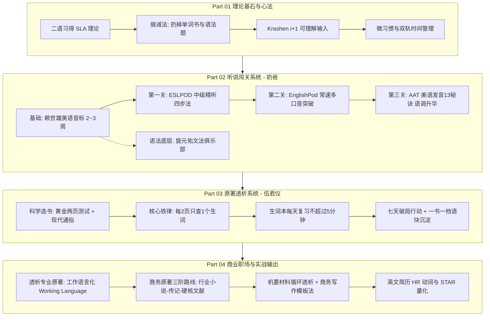

# 🛠️ 《把你的英语用起来！》全书方法论精读与实战指南

> **书名**：《把你的英语用起来！原地复活你放下多年的英语》  
> **作者**：伍君仪（透析英语创始人）、刘晓光（恶魔的奶爸）  
> **出版**：外文出版社 (2013)  
> **本地电子书文件**：[`docs/把你的英语用起来.pdf`](../docs/把你的英语用起来.pdf)  
> **定位**：基于**二语习得理论（SLA）**的自学英语破局经典，贯穿“播讲类听说输入 + 原著透析阅读 + 商务工作语言化”。

---

## 🧭 全书方法论全景导航 (Methodology Map)

---

# Part 01 怎样学英语才是最有效的（理论与心法）

### 1. 核心理论：克拉申（Stephen Krashen）二语习得假说（SLA）
* **习得（Acquisition）vs 学得（Learning）**：
  * *学得* 只能产生心理“监控器”，开口前在大脑中翻译语法公式，导致反应迟钝；
  * *习得* 依靠海量无意识的沉浸式输入，在大脑中建立起直接的语言直觉回路。
* **$i+1$ 可理解性输入假说（Comprehensible Input）**：
  * 语言提升的唯一途径是吸收难度略高于当前水平（$i+1$）的素材；
  * $i+0$（太简单）无法进步，$i+3$（超纲太多，如初学者硬啃无字幕美剧或学术文献）会退化为无法解析的噪音。
* **情感过滤假说（Affective Filter Hypothesis）**：
  * 焦虑、恐惧、枯燥会导致大脑情感屏障升高，阻碍语言输入；
  * 轻松、有趣、即时正反馈能让过滤网降至最低，吸收效率提升数十倍。

### 2. 坚定做“减法”
1. **扔掉单词书（词汇表）**：脱离语境死记中文释义是效率最低的假努力；
2. **扔掉语法题海**：母语者靠语感网络讲话，不靠做单选题；
3. **扔掉苦行僧式的句子成分精读**：不过度做主谓宾切分，保护整体语流心流。

### 3. 微习惯与时间管理双轨制
* **黄金时间（30~60分钟，早晨或固定整块）**：用于精听、文本研读与出声影子跟读；
* **碎片时间（1~2小时，通勤、散步、家务）**：用于**单曲循环复听已学透的音频磨耳朵**。

---

# Part 02 透析法大战播讲类材料（听说突破系统）

### 1. 为什么必须选“播讲类材料（Podcasts with explanations）”？
* **对比美剧/电影**：画面干扰大、语速过快、容易依赖中文字幕；
* **对比普通新闻（VOA/BBC）**：生硬严肃，缺乏日常生活生命力；
* **播讲类材料的核心优势**：母语外教用地道慢速/常速进行 **English-in-English 口语化讲解**，自带保姆级可理解性阶梯。

### 2. 听说进阶四大阶梯

| 阶段 | 核心材料 / 课程 | 耗时周期 | 核心目标与操作方法 |
| :--- | :--- | :---: | :--- |
| **发音准备** | **《赖世雄美语音标》** | 2~3 周 | 对着镜子看口型，大声夸张朗读，彻底纠正中国学生元音不饱满、`/v/`与`/w/`、`/θ/`与`/s/`、`/l/`与`/r/`易混淆等发音缺陷。 |
| **第一关（中级）** | **ESLPOD (English as a Second Language Podcast)** *(推荐6本经典教材套系)* | 3~4 个月 | **精听四步法**： ① **盲听（1~2遍）** 抓大意与盲点； ② **对照文本听讲解** 搞懂生词与文化； ③ **扫清词汇障碍** 大声朗读文本； ④ **脱稿影子跟读（Shadowing）** 模仿语调连读直到同步。 |
| **第二关（中高级）** | **EnglishPod (全365期)** | 2~3 个月 | **突破 100% 真实母语常速（Native Speed）与多元口音**。 研读 Dialogue Script 剧本，提取高频俚语与生活化语块，将 Dialog-Only 纯对话音频在碎片时间单曲循环。 |
| **第三关（高级）** | **AAT《标准美语发音的13秘诀》** *(American Accent Training)* | 1 个月 | **攻克地道美式韵律与音乐感**： ① **梯阶语调（Staircase Intonation）** 重读爬升与滑动； ② **连读与同化（Liaisons）**； ③ **美音 4 种 T 音变**（Flap T 闪音, Glottal T 喉塞音, Held T 停顿, Silent T 静音）。 |

### 3. 语法底层认知：旋元佑《英文魔法师语法俱乐部 / 旋元佑文法》
* **核心定位**：底层操作系统与解惑地图，**绝不刷题、不背死规则**；
* **核心心法**：掌握“五大基本句型”与统一优美的**“从句简化理论（Clause Reduction）”**，长难句迎刃而解。

---

# Part 03 透析法大战英文原著（阅读与词汇系统）

### 1. 科学选书第一性原理
* **黄金两页测试法（3分钟定生死）**：翻开第 3~5 页连续读两页：
  * 生词 $\le 2$ 个且理解顺畅 $\to$ **选它！（完美 $i+1$ 心流）**
  * 生词 $> 5$ 个且读不懂 $\to$ **果断放弃（属于 $i+3$，避免耗尽意志力）**。
* **题材原则**：优先选 2000 年之后的**当代通俗小说（Thriller/Fiction）与现代非虚构（Pop Non-fiction）**；初学者坚决不碰 19 世纪古典文学。

### 2. 透析法核心心法：**每 2 页只查 1 个生词（The 50% Rule）**
* **严格限额**：纸质书每开一页（左右两面）/ 电子书每两屏，**最多只查 1 个核心生词**；
* **保护心流**：其余生词靠上下文猜测或直接略过，保持高速翻页带来的正反馈；
* **生词复习策略**：存入电子词典生词本，**每天只需浏览 3~5 分钟，绝对不强制死背**，依靠后续章节与其他书籍中的**“自然高频重现”**完成终身记忆。

### 3. 执行与打卡闭环
* **七天置之死地行动**：选一本 100~200 页薄原著，7 天内读完，打破“一辈子没读过一本原著”的心魔；
* **一年 10 本原著长跑**：累计 80~100 万字的高质量输入，词汇量与语感脱胎换骨；
* **一书一档读后档案**：记录元数据 + 提取 3~5 个高价值语块 + 个人生活场景微造句 + AI 对话交锋。

---

# Part 04 商业社会的常用英语（职场与工作语言化）

### 1. 英语工作语言化（Working Language）
* **专业降维**：读自己专业领域的英文原著与文献，比读小说更容易（已有丰富的中文专业背景图式支撑）；
* **商务英语真相**：纯商业教材（如 MBA《博迪投资学》）的词汇量远少于文学作品，语言标准规范，是纸老虎。

### 2. 提升商务英语三阶路线图
1. **Step 1 行业小说打底**：阿瑟·黑利（Arthur Hailey）的职场行业小说（《钱商》《大饭店》《航空港》）；
2. **Step 2 商业畅销与传记**：《谁动了我的奶酪》《金钱心理学》《鞋狗》《从0到1》《乔布斯传》；
3. **Step 3 硬核教材与智库**：哈佛商业评论（HBR）、专业白皮书、行业前沿研报。

### 3. 机要材料循环透析与商务写作模板法
* **循环透析（Cyclic Dialysis）**：面对涉外合同、高层汇报等不允许歧义的文件，通过 2~3 轮提高密度的循环精读彻底过滤生词；
* **模板置换法**：收集母语商务邮件与报告模板，只做骨架语块置换，确保 100% 安全地道。

---

# 📚 附录精粹

* **附录 1（生活贴士）**：利用**微信异步语音条**进行口语对练（思考好再发、上滑取消、回听纠错）；桌面壁纸英语矩阵；英文菜谱实操。
* **附录 2（资源合集）**：EnglishPod 商业频道期数索引；100 本经典原著推荐清单；全球主流英文媒体流媒体直链。
* **附录 3（科学数据）**：`testyourvocab.com` 统计显示母语成人词汇量在 20,000~35,000；非母语者通过高质量沉浸输入，国内同样能实现词汇指数级增长。

---

### 💡 与本项目 `sudo-learn-english` 的第一性原理映射

| 《把你的英语用起来》经典方法 | 本项目 `sudo-learn-english` 的升级实现 |
| :--- | :--- |
| **ESLPOD 精听四步法** | [`ESLPOD.md`](../ESLPOD.md) 录音精听与影子跟读机制 |
| **透析法每2页查1词** | 原著零查词心流通读 + 读后语块提取 |
| **透析记录归档** | [`books/`](../books/) 目录下一书一档 + 场景微造句 + AI 对话 |
| **商业与经管路线** | 聚焦现代经管/自控/商业传记（《奶酪》$\to$《金钱心理学》$\to$《鞋狗》） |
